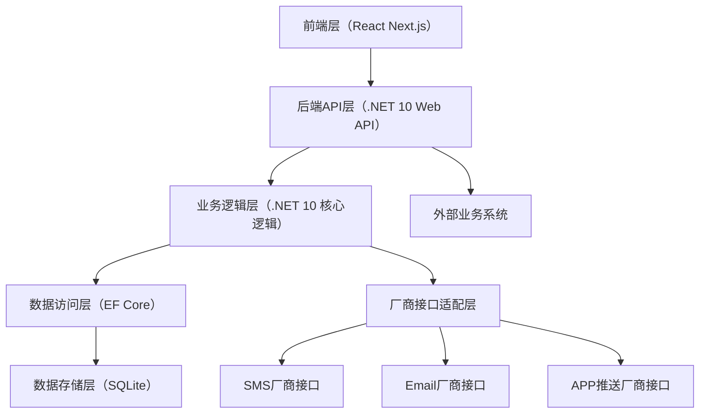
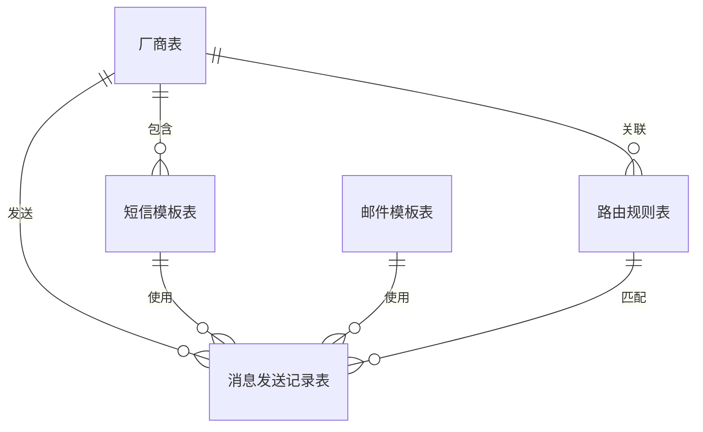

# MsgPulse消息平台管理系统需求文档

## 1. 项目概述

### 1.1 项目目标
你需要开发的MsgPulse消息平台管理系统，核心目标是构建一个统一的消息发送管控中心，支持多厂商的短信（SMS）、邮件（Email）、APP推送渠道配置，通过模板管理和路由规则实现消息发送渠道的灵活选择，并留存完整的发送记录；同时对外提供标准化API接口，供其他业务系统调用消息发送能力，整体技术栈为后端.NET 10 + EF Core + SQLite，前端React Next.js，无权限管控、无SAAS/租户隔离需求。

### 1.2 核心价值
- 统一管控：聚合多厂商消息发送渠道，避免业务系统直接对接多个厂商接口的复杂度；
- 灵活配置：通过模板和路由规则，按需选择消息发送渠道，适配不同场景需求；
- 可追溯性：完整留存消息发送记录及状态，便于问题排查和数据统计；
- 开放能力：标准化API对外输出，快速赋能其他业务系统的消息发送需求。

### 1.3 技术栈约定
- 后端：.NET 10（Web API）、EF Core（ORM）、SQLite（数据库）；
- 前端：React + Next.js（服务端渲染/客户端渲染结合）；
- 集成方式：厂商接口通过HTTP/SDK集成，内部通过EF Core操作SQLite，前后端通过RESTful API交互。

## 2. 功能需求
### 2.1 厂商管理模块
#### 2.1.1 核心能力
支持多厂商的短信、邮件、APP推送渠道配置，实现厂商渠道的全生命周期管理。
#### 2.1.2 具体功能点
| 功能项 | 详细描述 |
|--------|----------|
| 厂商列表 | 展示所有已配置的厂商信息，包含厂商名称、支持的渠道类型（SMS/Email/APP推送）、状态（启用/禁用）、创建时间；支持按厂商名称、渠道类型筛选。 |
| 厂商新增 | 支持新增厂商，需配置：<br>1. 基础信息：厂商名称、标识（唯一）、描述、支持的渠道类型（可多选）；<br>2. 渠道配置：<br> - SMS：API地址、AppKey、AppSecret、签名、手机号前缀等厂商专属参数；<br> - Email：SMTP地址/API地址、端口、账号、密码、发件人、加密方式等；<br> - APP推送：AppID、AppSecret、推送接口地址、设备标识前缀等；<br>3. 状态配置：默认启用/禁用。 |
| 厂商编辑 | 支持修改已配置厂商的基础信息、渠道配置参数、状态；禁用的厂商不可被路由规则选中。 |
| 厂商删除 | 支持删除无关联模板/路由规则/发送记录的厂商；若有关联，需提示“存在关联数据，无法删除”。 |
| 厂商测试 | 对已配置的厂商渠道进行连通性测试：<br> - SMS：发送测试短信到指定手机号；<br> - Email：发送测试邮件到指定邮箱；<br> - APP推送：推送测试消息到指定设备标识；<br>返回测试结果（成功/失败）及失败原因。 |
| 短信模板同步 | 对提供“模板查询接口”的SMS厂商，支持一键同步该厂商的短信模板到系统内；同步后可在模板管理模块查看和编辑。 |

### 2.2 模板管理模块
#### 2.2.1 短信模板管理
| 功能项 | 详细描述 |
|--------|----------|
| 模板列表 | 展示所有短信模板，包含模板名称、模板编码、所属厂商、模板内容、变量列表、审核状态（厂商审核/未审核）、状态（启用/禁用）；支持按厂商、模板编码、状态筛选。 |
| 模板新增（手动） | 配置短信模板：模板名称、所属厂商、模板内容（支持变量占位符，如`{username}`）、变量列表（标注变量名称及说明）、审核状态（手动标记）、状态（启用/禁用）。 |
| 模板编辑 | 修改已配置的短信模板内容、变量、状态等；若模板已被发送记录关联，仅允许修改状态，不允许修改核心内容（模板编码、内容、所属厂商）。 |
| 模板删除 | 删除无关联发送记录的短信模板；有关联时提示无法删除。 |

#### 2.2.2 邮件模板管理
| 功能项 | 详细描述 |
|--------|----------|
| 模板列表 | 展示所有邮件模板，包含模板名称、模板编码、主题、内容类型（纯文本/HTML）、模板内容、变量列表、状态（启用/禁用）；支持按模板编码、状态筛选。 |
| 模板新增 | 配置邮件模板：模板名称、模板编码（唯一）、主题（支持变量占位符）、内容类型、模板内容（支持HTML/纯文本，含变量占位符）、变量列表、状态（启用/禁用）。 |
| 模板编辑 | 修改邮件模板的主题、内容、变量、状态等；若模板已被发送记录关联，核心信息（模板编码）不可修改。 |
| 模板删除 | 删除无关联发送记录的邮件模板；有关联时提示无法删除。 |

### 2.3 路由规则配置模块
#### 2.3.1 核心能力
配置路由规则，实现“根据指定条件选择对应厂商渠道发送消息”的能力，支持SMS、Email、APP推送三类消息的路由配置。
#### 2.3.2 具体功能点
| 功能项 | 详细描述 |
|--------|----------|
| 路由规则列表 | 展示所有路由规则，包含规则名称、适用消息类型（SMS/Email/APP推送）、匹配条件、目标厂商、优先级、状态（启用/禁用）；支持按消息类型、状态筛选。 |
| 规则新增 | 配置路由规则：<br>1. 基础信息：规则名称、适用消息类型（单选：SMS/Email/APP推送）、优先级（数字越小优先级越高）、状态（启用/禁用）；<br>2. 匹配条件：支持配置多条件组合（且/或），如：<br> - 消息类型：指定模板编码/模板名称模糊匹配；<br> - 接收方：手机号前缀/邮箱域名/设备类型等；<br> - 自定义标签：业务系统传入的自定义标识（如“订单通知”“验证码”）；<br>3. 目标配置：选择该规则匹配成功后使用的厂商（需为启用状态的对应渠道厂商）。 |
| 规则编辑 | 修改路由规则的匹配条件、优先级、目标厂商、状态；优先级决定规则匹配顺序（高优先级先匹配）。 |
| 规则删除 | 删除无生效记录的路由规则；有生效记录时提示无法删除。 |
| 规则测试 | 输入测试条件（如模板编码、接收手机号），验证规则是否匹配成功，并返回匹配的目标厂商。 |

### 2.4 消息发送模块
#### 2.4.1 手动发送（管理端）
| 功能项 | 详细描述 |
|--------|----------|
| 单条发送 | 支持在管理端手动发起消息发送：<br> - SMS：选择短信模板、输入接收手机号、替换变量值，系统根据路由规则匹配厂商发送；<br> - Email：选择邮件模板、输入接收邮箱、替换变量值，系统根据路由规则匹配厂商发送；<br> - APP推送：输入接收设备标识、消息标题/内容（或选择推送模板），系统根据路由规则匹配厂商发送；<br>发送后实时返回发送结果（待处理/成功/失败）。 |
| 批量发送 | 支持上传文件（如CSV）批量导入接收方（手机号/邮箱/设备标识），选择对应模板，批量发起消息发送；展示批量发送进度和总体成功率。 |

#### 2.4.2 API调用发送
对外提供标准化API，支持其他业务系统调用发送SMS/Email/APP推送消息，具体能力：
- 接收参数：消息类型、模板编码、接收方、变量值、自定义标签（用于路由匹配）；
- 处理逻辑：验证参数合法性 → 根据路由规则匹配目标厂商 → 调用厂商接口发送消息 → 返回发送任务ID；
- 异步回调：支持配置回调地址，消息发送状态变更（如从“发送中”变为“成功/失败”）时，推送回调信息。

### 2.5 消息记录管理模块
#### 2.5.1 核心能力
完整留存所有消息的发送记录及状态，支持查询、筛选、详情查看。
#### 2.5.2 具体功能点
| 功能项 | 详细描述 |
|--------|----------|
| 记录列表 | 展示所有消息发送记录，包含任务ID、消息类型、模板编码、接收方、所属厂商、发送状态、发送时间、失败原因（如有）；支持按：<br> - 时间范围（创建时间/发送时间）；<br> - 消息类型（SMS/Email/APP推送）；<br> - 发送状态（待发送/发送中/成功/失败）；<br> - 所属厂商；<br>进行多条件筛选，支持分页。 |
| 记录详情 | 查看单条记录的完整信息：<br> - 基础信息：任务ID、消息类型、模板编码、接收方、自定义标签；<br> - 路由信息：匹配的路由规则、目标厂商；<br> - 发送信息：发送时间、完成时间、厂商返回的原始响应、状态码；<br> - 异常信息：失败原因、错误码、重试次数（如有）。 |
| 记录导出 | 支持将筛选后的记录导出为Excel/CSV文件，包含列表所有字段。 |
| 失败重试 | 对“失败”状态的记录，支持手动触发重试发送；重试后更新记录状态和失败原因（如有）。 |

## 3. 非功能需求
### 3.1 性能需求
- 接口响应时间：管理端接口响应≤500ms，API发送接口响应≤1000ms；
- 并发能力：支持至少100QPS的API调用请求，批量发送时单批次支持≤1000条消息的处理；
- 数据存储：SQLite单表支持≥10万条发送记录的存储和快速查询（通过索引优化）。

### 3.2 可靠性需求
- 消息不丢失：API接收的发送请求需先落库（状态为“待发送”），再执行发送逻辑；
- 失败重试：厂商接口调用失败时，支持配置自动重试策略（重试次数、间隔时间）；
- 异常处理：厂商接口返回异常、网络超时等场景，需捕获异常并记录详细失败原因，不影响系统整体可用性。

### 3.3 易用性需求
- 前端界面：操作流程简洁，模板配置、路由规则配置提供可视化表单，支持参数校验和提示；
- 错误提示：所有操作失败时，返回清晰的错误信息（如“厂商配置参数缺失”“模板变量未替换完整”）；
- 文档支持：提供API接口文档（含参数说明、示例、错误码），便于业务系统集成。

### 3.4 可扩展性需求
- 厂商扩展：新增消息厂商时，仅需新增厂商配置参数和接口适配逻辑，无需修改核心流程；
- 模板扩展：支持新增模板类型（如后续新增语音模板），核心表结构预留扩展字段；
- 路由条件扩展：路由规则的匹配条件支持新增维度（如发送时间段），无需重构规则匹配逻辑。

### 3.5 兼容性需求
- 前端兼容：支持主流浏览器（Chrome/Firefox/Edge），适配PC端不同分辨率；
- 厂商接口兼容：支持RESTful API、HTTP/HTTPS协议的厂商接口集成；
- SQLite兼容：适配EF Core对SQLite的操作规范，支持SQLite 3.x及以上版本。

## 4. 系统架构设计（高层）
### 4.1 架构分层

#### 各层职责
- 前端层：提供管理端可视化操作界面，包括厂商配置、模板管理、路由配置、记录查询等；
- 后端API层：对外提供RESTful API，对内承接前端请求，处理参数校验、权限（无）、请求转发；
- 业务逻辑层：实现核心业务逻辑（路由匹配、消息发送、模板管理、记录留存等）；
- 数据访问层：通过EF Core操作SQLite，实现数据的增删改查；
- 厂商接口适配层：封装不同厂商的接口调用逻辑，提供统一的发送接口给业务逻辑层；
- 数据存储层：SQLite存储所有配置数据和发送记录。

## 5. 数据模型设计（概念层）
### 5.1 核心实体及关系


### 5.2 核心表结构（概念字段）
| 表名 | 核心字段 | 说明 |
|------|----------|------|
| 厂商表（Manufacturer） | 厂商ID、名称、标识、描述、支持渠道类型、SMS配置（JSON）、Email配置（JSON）、APP推送配置（JSON）、状态、创建时间、更新时间 | 存储厂商基础信息及各渠道的配置参数（JSON格式适配不同厂商的参数差异） |
| 短信模板表（SmsTemplate） | 模板ID、厂商ID、模板名称、模板编码、模板内容、变量列表（JSON）、审核状态、状态、创建时间、更新时间 | 存储短信模板信息，关联所属厂商 |
| 邮件模板表（EmailTemplate） | 模板ID、模板名称、模板编码、主题、内容类型、模板内容、变量列表（JSON）、状态、创建时间、更新时间 | 存储邮件模板信息，无所属厂商（邮件发送可适配多厂商） |
| 路由规则表（RouteRule） | 规则ID、规则名称、适用消息类型、匹配条件（JSON）、目标厂商ID、优先级、状态、创建时间、更新时间 | 存储路由规则，匹配条件为JSON格式（适配多条件组合） |
| 消息发送记录表（MessageRecord） | 记录ID、任务ID、消息类型、模板编码、接收方、变量值（JSON）、所属厂商ID、路由规则ID、发送状态、发送时间、完成时间、厂商响应（JSON）、失败原因、自定义标签、创建时间 | 存储所有消息发送的完整记录 |

## 6. API接口设计（高层）
### 6.1 接口规范
- 协议：HTTP/HTTPS；
- 请求方式：GET（查询）、POST（新增/发送）、PUT（编辑）、DELETE（删除）；
- 数据格式：JSON；
- 状态码：遵循HTTP标准状态码（200成功、400参数错误、500服务器异常等）；
- 响应格式：
  ```json
  {
    "code": 200,
    "msg": "操作成功",
    "data": {}
  }
  ```

### 6.2 核心接口列表
| 接口分类 | 接口名称 | 请求方式 | 核心参数 | 核心响应 |
|----------|----------|----------|----------|----------|
| 厂商管理 | 新增厂商 | POST | 厂商名称、标识、支持渠道类型、各渠道配置参数、状态 | 厂商ID、操作结果 |
| 厂商管理 | 同步短信模板 | POST | 厂商ID | 同步成功数量、失败列表 |
| 模板管理 | 新增短信模板 | POST | 厂商ID、模板名称、模板编码、模板内容、变量列表 | 模板ID、操作结果 |
| 路由配置 | 新增路由规则 | POST | 规则名称、适用消息类型、匹配条件、目标厂商ID、优先级 | 规则ID、操作结果 |
| 消息发送 | API发送消息 | POST | 消息类型、模板编码、接收方、变量值、自定义标签 | 任务ID、发送状态 |
| 记录管理 | 查询发送记录 | GET | 时间范围、消息类型、发送状态、厂商ID | 记录列表、总条数 |
| 记录管理 | 失败记录重试 | POST | 记录ID | 重试结果、新状态 |

## 7. 总结
### 核心关键点回顾
1. 系统核心围绕“多厂商渠道配置-模板管理-路由规则-消息发送-记录留存”全流程构建，实现消息发送的统一管控；
2. 功能层面分为五大核心模块：厂商管理（多渠道配置+模板同步）、模板管理（短信/邮件）、路由配置（条件匹配选厂商）、消息发送（手动+API）、记录管理（查询/重试/导出）；
3. 非功能层面重点保障接口响应性能、消息发送可靠性，同时预留厂商/模板/路由的扩展能力，适配后续业务变化。

### 落地建议
1. 优先实现核心流程（厂商配置→模板配置→路由配置→API发送→记录查询），再补充批量发送、失败重试等进阶功能；
2. 厂商接口适配层采用“接口+实现类”的设计，新增厂商时仅需新增实现类，降低耦合；
3. SQLite需针对发送记录表建立索引（如任务ID、发送时间、厂商ID），保障大数据量下的查询性能。